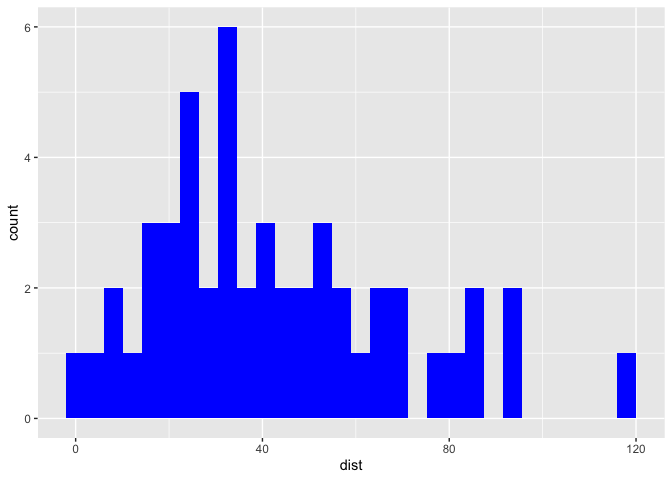

  - [*To the reader*](#to-the-reader)
  - [Part 0. Proposal](#part-0-proposal)
  - [Part I. Work out functionality ✅](#part-i-work-out-functionality-)
      - [Try it out](#try-it-out)
  - [Part II. Packaging and documentation 🚧
    ✅](#part-ii-packaging-and-documentation--)
      - [Phase 1. Minimal working
        package](#phase-1-minimal-working-package)
      - [Phase 2: Listen & iterate 🚧 ✅](#phase-2-listen--iterate--)
      - [Phase 3: Settling and testing 🚧
        ✅](#phase-3-settling-and-testing--)
      - [Phase 4. Promote to wider audience… 🚧
        ✅](#phase-4-promote-to-wider-audience--)
      - [Phase 5: Harden/commit: Submit to CRAN/RUniverse 🚧
        ✅](#phase-5-hardencommit-submit-to-cranruniverse--)
  - [Appendix: Reports, Environment](#appendix-reports-environment)
      - [Description file complete? 🚧 ✅](#description-file-complete--)
      - [Environment 🚧 ✅](#environment--)
      - [`devtools::check()` report](#devtoolscheck-report)
      - [Package directory file tree](#package-directory-file-tree)

<!-- badges: start -->

[](https://lifecycle.r-lib.org/articles/stages.html#experimental)
<!-- badges: end -->

# *To the reader*

Welcome to the R package building helper *readme2pkg.template*\!

Below, is a readme that provides steps for building a package. This
readme acts as a worksheet, checklist, and control document as functions
used in package building are included within.

We’ll use the `{readme2pkg}` helper package to send code chunks to
different directories in the package.

To install `{readme2pkg}`:

``` 

remotes::install_github("EvaMaeRey/readme2pkg")
```

# Part 0. Proposal

Proposing the {xxxx} package\! 🦄
<!-- (typical package introduction write up; but actually aspirational) -->

The goal of {xxxx} is to make … easier.

Without the package, we live in the effort-ful world that follows 🏋:

``` r
library(ggplot2)
ggplot(cars, aes(x = dist)) + 
  geom_histogram(fill = "blue")
#> `stat_bin()` using `bins = 30`. Pick better value with `binwidth`.
```

<!-- -->

With the {bluehistogram} package, we’ll live in a different world (🦄 🦄
🦄) where the task is a snap 🫰:

Proposed API:

``` 

library(bluehistogram)
library(ggplot2)

ggplot(cars, aes(x = dist)) + 
  geom_histogram_blue()
```

# Part I. Work out functionality ✅

Here is a function that will do some work…

``` r
geom_histogram_blue <- function(...){
  
  geom_histogram(fill = "blue", ...)
  
}
```

## Try it out

``` r
ggplot(cars, aes(x = dist)) + 
  geom_histogram_blue()
#> `stat_bin()` using `bins = 30`. Pick better value with `binwidth`.
```

<!-- -->

# Part II. Packaging and documentation 🚧 ✅

## Phase 1. Minimal working package

### Bit A. Created package archetecture, running `devtools::create(".")` in interactive session. 🚧 ✅

``` r
devtools::create(".")
```

### Bit B. Managing [dependencies](https://r-pkgs.org/dependencies-in-practice.html)? 🚧 ✅

Dependencies must be declared in your package.

This means …

1.  you’ll use the `::` notation, e.g. `package::function()` in your
    functions when you use another package’s functions (i.e. not base R
    function).  
2.  you’ll send package dependencies to your DESCRIPTION file; which can
    be done automatically with `usethis::use_package`:

<!-- end list -->

``` r
usethis::use_package("ggplot2")
```

### Bit C. Moved functions [R code folder](https://r-pkgs.org/code.html)? 🚧 ✅

Use new {readme2pkg} function to do this from readme…

``` r
library(stringr) #!!!
readme2pkg::chunk_to_r(chunk_name = "geom_histogram_blue")
```

### Bit D. Run [`devtools::check()`](https://r-pkgs.org/whole-game.html#check) and address errors. 🚧 ✅

``` r
devtools::check(pkg = ".")
```

devtools check will document the functions for you.

### Bit E. [Install](https://r-pkgs.org/whole-game.html#install) and restart package 🚧 ✅

``` r
devtools::install(pkg = ".")
```

### Bit F. Write traditional README that uses built package (also serves as a test of build). 🚧 ✅

The goal of the {xxxx} package is to …

Install package with:

    remotes::installgithub("EvaMaeRey/r2ptest2march20")

Once functions are exported you can remove go to two colons, and when
things are are really finalized, then go without colons (and rearrange
your readme…)

``` r
library(r2ptest2march20)  ##<< change to your package name here
library(ggplot2)

ggplot(cars, aes(x = dist)) +
  r2ptest2march20:::geom_histogram_blue()
```

### Bit G. Add [lifecycle badge](https://r-pkgs.org/lifecycle.html) (experimental) 🚧 ✅

``` r
usethis::use_lifecycle_badge("experimental")
```

### Bit H. Compile READme

### Bit I. Push to github.

RStudio: Console/Terminal/RMarkdown/Jobs:

Terminal -\> git add . -\> git commit -m “first commit” -\> git push

## Phase 2: Listen & iterate 🚧 ✅

Try to get feedback from experts on API, implementation, default
decisions. Is there already work that solves this problem?

## Phase 3: Settling and testing 🚧 ✅

### Bit A. Added a description and author information in the [DESCRIPTION file](https://r-pkgs.org/description.html) 🚧 ✅

### Bit B. Added [roxygen skeleton](https://r-pkgs.org/man.html)? 🚧 ✅

Use a roxygen skeleton for auto documentation and making sure proposed
functions are *exported*. (in RStudio ’Code -\> insert Roxygen Skeleton)
Generally, early on, I don’t do much (anything) in terms of filling in
the skeleton for documentation, because things may change.

### Bit C. Chosen a [license](https://r-pkgs.org/license.html)? 🚧 ✅

``` r
usethis::use_mit_license()
```

### Bit D. Settle on [examples](https://r-pkgs.org/man.html#sec-man-examples). Put them in the roxygen skeleton and readme. 🚧 ✅

### Bit E. Written formal [tests](https://r-pkgs.org/testing-basics.html) of functions and save to test that folders 🚧 ✅

That would look like this…

``` r
library(testthat)

test_that("calc times 2 works", {
  expect_equal(times_two(4), 8)
  expect_equal(times_two(5), 10)
  
})
```

``` r
readme2pkg::chunk_to_tests_testthat("test_calc_times_two_works")
```

### Bit F. Check again. Addressed notes, warnings and errors. 🚧 ✅

``` r
devtools::check(pkg = ".")
```

## Phase 4. Promote to wider audience… 🚧 ✅

### Bit A. Package website built? 🚧 ✅

### Bit B. Package website deployed? 🚧 ✅

## Phase 5: Harden/commit: Submit to CRAN/RUniverse 🚧 ✅

# Appendix: Reports, Environment

## Description file complete? 🚧 ✅

``` r
readLines("DESCRIPTION")
```

## Environment 🚧 ✅

Here I just want to print the packages and the versions

``` r
all <- sessionInfo() |> print() |> capture.output()
all[11:17]
#> [1] ""                                                                         
#> [2] "attached base packages:"                                                  
#> [3] "[1] stats     graphics  grDevices utils     datasets  methods   base     "
#> [4] ""                                                                         
#> [5] "other attached packages:"                                                 
#> [6] "[1] ggplot2_3.4.4.9000"                                                   
#> [7] ""
```

## `devtools::check()` report

``` r
devtools::check(pkg = ".")
```

## Package directory file tree

``` r
fs::dir_tree(recurse = T)
#> .
#> ├── DESCRIPTION
#> ├── NAMESPACE
#> ├── R
#> │   └── geom_histogram_blue.R
#> ├── README.Rmd
#> ├── README.md
#> ├── README_files
#> │   └── figure-gfm
#> │       ├── unnamed-chunk-2-1.png
#> │       └── unnamed-chunk-3-1.png
#> ├── r2ptest2march20.Rproj
#> └── readme2pkg.template.Rproj
```
